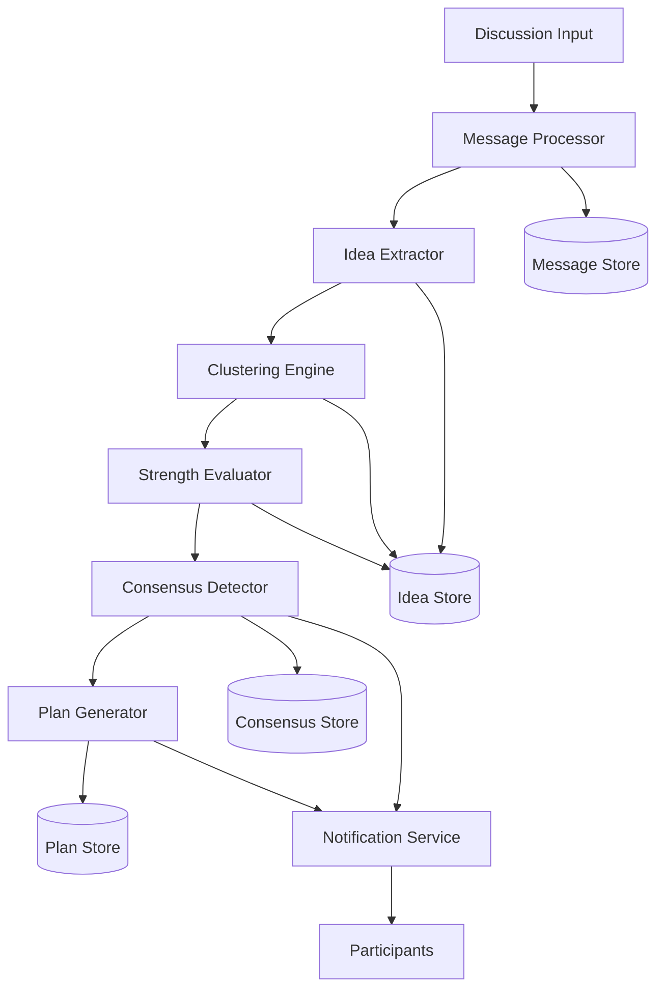

# Design Document: AI-Powered Group Decision & Execution Engine

## Overview

The AI-Powered Group Decision & Execution Engine is a real-time collaboration system that transforms unstructured team discussions into actionable project plans. The system operates in two primary modes: **Discussion Mode** (monitoring, analyzing, and detecting consensus) and **Execution Mode** (generating structured project artifacts).

The architecture follows a pipeline approach where discussion messages flow through multiple processing stages: ingestion → idea extraction → clustering → strength evaluation → consensus detection → plan generation. Each stage is designed to be modular and independently testable.

Key design principles:
- **Real-time processing**: Messages are analyzed as they arrive
- **Incremental updates**: Clusters, scores, and consensus status update continuously
- **Transparency**: All AI decisions are explainable and visible to participants
- **Flexibility**: Support for multiple input formats and discussion platforms

## Architecture

The system consists of six core subsystems:



### Subsystem Responsibilities

1. **Message Processor**: Ingests messages from various sources, normalizes format, extracts metadata (timestamp, author, content)

2. **Idea Extractor**: Uses NLP to identify proposals/suggestions in messages, distinguishes new ideas from comments, maintains idea-message relationships

3. **Clustering Engine**: Computes semantic similarity between ideas, groups related ideas, assigns cluster labels, dynamically updates clusters as new ideas arrive

4. **Strength Evaluator**: Tracks engagement metrics (reactions, replies, mentions), analyzes reasoning quality, computes composite strength scores, maintains rankings

5. **Consensus Detector**: Monitors participant support patterns, calculates consensus thresholds, detects when agreement is reached, triggers execution mode transition

6. **Plan Generator**: Synthesizes discussion context and consensus, generates structured project artifacts (problem statement, features, tasks, roadmap, timeline, tech stack, risks)

## Components and Interfaces

### Message Processor

**Input**: Raw messages from discussion platforms (chat, transcripts, forms)

**Output**: Normalized message objects

```typescript
interface Message {
  id: string;
  author: string;
  content: string;
  timestamp: Date;
  platform: string;
  metadata: Record<string, any>;
}

class MessageProcessor {
  ingest(rawMessage: any, platform: string): Message;
  normalize(rawMessage: any): Message;
  store(message: Message): void;
  getHistory(sessionId: string): Message[];
}
```

### Idea Extractor

**Input**: Normalized messages

**Output**: Extracted ideas with metadata

```typescript
interface Idea {
  id: string;
  content: string;
  author: string;
  sourceMessageId: string;
  timestamp: Date;
  reasoning: string[];
  clusterId?: string;
}

class IdeaExtractor {
  extract(message: Message): Idea | null;
  isNewIdea(message: Message, existingIdeas: Idea[]): boolean;
  linkToExisting(message: Message, ideas: Idea[]): string | null;
  extractReasoning(content: string): string[];
}
```

### Clustering Engine

**Input**: Ideas

**Output**: Clusters with similarity scores

```typescript
interface Cluster {
  id: string;
  label: string;
  ideas: string[]; // idea IDs
  centroid: number[]; // embedding vector
  createdAt: Date;
  updatedAt: Date;
}

class ClusteringEngine {
  computeSimilarity(idea1: Idea, idea2: Idea): number;
  assignToCluster(idea: Idea, clusters: Cluster[]): string;
  createCluster(idea: Idea): Cluster;
  generateLabel(cluster: Cluster, ideas: Idea[]): string;
  updateCentroid(cluster: Cluster, ideas: Idea[]): void;
}
```

### Strength Evaluator

**Input**: Ideas, engagement data

**Output**: Strength scores and rankings

```typescript
interface EngagementData {
  ideaId: string;
  reactions: number;
  replies: number;
  mentions: number;
  supporters: string[]; // participant IDs
}

interface IdeaStrength {
  ideaId: string;
  engagementScore: number;
  reasoningScore: number;
  totalStrength: number;
  rank: number;
}

class StrengthEvaluator {
  calculateEngagementScore(engagement: EngagementData): number;
  calculateReasoningScore(idea: Idea): number;
  calculateTotalStrength(engagement: number, reasoning: number): number;
  rankIdeas(strengths: IdeaStrength[]): IdeaStrength[];
  updateStrength(ideaId: string, newEngagement: EngagementData): IdeaStrength;
}
```

### Consensus Detector

**Input**: Ideas, strength scores, participant data

**Output**: Consensus status and notifications

```typescript
interface ConsensusStatus {
  detected: boolean;
  ideaId: string;
  type: 'strong' | 'weak' | 'none';
  supportPercentage: number;
  activeParticipants: number;
  supporters: string[];
  timestamp?: Date;
}

class ConsensusDetector {
  detectConsensus(ideas: Idea[], strengths: IdeaStrength[], participants: string[]): ConsensusStatus;
  calculateSupportPercentage(ideaId: string, participants: string[]): number;
  determineConsensusType(supportPercentage: number): 'strong' | 'weak' | 'none';
  monitorBreakdown(consensusStatus: ConsensusStatus, newMessages: Message[]): boolean;
  triggerExecutionMode(consensusStatus: ConsensusStatus): void;
}
```

### Plan Generator

**Input**: Consensus idea, discussion context

**Output**: Structured project plan

```typescript
interface ProjectPlan {
  problemStatement: ProblemStatement;
  features: Feature[];
  tasks: Task[];
  roadmap: Roadmap;
  timeline: Timeline;
  techStack: TechStackRecommendation;
  risks: RiskAnalysis;
  generatedAt: Date;
}

interface ProblemStatement {
  problem: string;
  targetUsers: string[];
  desiredOutcomes: string[];
}

interface Feature {
  id: string;
  name: string;
  description: string;
  priority: 'must-have' | 'should-have' | 'nice-to-have';
}

interface Task {
  id: string;
  featureId: string;
  description: string;
  effort: 'small' | 'medium' | 'large';
  dependencies: string[]; // task IDs
  estimatedHours: number;
}

interface Roadmap {
  phases: Phase[];
}

interface Phase {
  name: string;
  features: string[]; // feature IDs
  milestones: string[];
  order: number;
}

interface Timeline {
  totalDuration: number; // in days
  phaseTimelines: Map<string, number>;
  assumptions: string[];
}

interface TechStackRecommendation {
  frontend: TechChoice[];
  backend: TechChoice[];
  database: TechChoice[];
  infrastructure: TechChoice[];
}

interface TechChoice {
  technology: string;
  justification: string;
  alternatives: string[];
}

interface RiskAnalysis {
  risks: Risk[];
}

interface Risk {
  id: string;
  description: string;
  category: 'technical' | 'project' | 'team';
  severity: 'low' | 'medium' | 'high';
  mitigation: string;
}

class PlanGenerator {
  generate(consensus: ConsensusStatus, context: DiscussionContext): ProjectPlan;
  generateProblemStatement(consensus: ConsensusStatus, context: DiscussionContext): ProblemStatement;
  generateFeatures(problemStatement: ProblemStatement, context: DiscussionContext): Feature[];
  generateTasks(features: Feature[]): Task[];
  generateRoadmap(features: Feature[], tasks: Task[]): Roadmap;
  generateTimeline(tasks: Task[], assumptions: TimelineAssumptions): Timeline;
  recommendTechStack(features: Feature[], context: DiscussionContext): TechStackRecommendation;
  analyzeRisks(plan: Partial<ProjectPlan>): RiskAnalysis;
}
```

## Data Models

### Core Entities

**Discussion Session**
```typescript
interface DiscussionSession {
  id: string;
  participants: Participant[];
  messages: Message[];
  ideas: Idea[];
  clusters: Cluster[];
  consensus?: ConsensusStatus;
  plan?: ProjectPlan;
  mode: 'discussion' | 'execution';
  startedAt: Date;
  updatedAt: Date;
}
```

**Participant**
```typescript
interface Participant {
  id: string;
  name: string;
  joinedAt: Date;
  contributions: {
    messagesCount: number;
    ideasProposed: number;
    engagements: number;
  };
}
```

### Storage Schema

The system uses a document-based storage model with the following collections:

- **sessions**: Discussion sessions with embedded participants
- **messages**: All messages with session references
- **ideas**: Extracted ideas with cluster assignments
- **clusters**: Idea clusters with metadata
- **plans**: Generated project plans

Indexes:
- `messages.sessionId` + `messages.timestamp` (for chronological retrieval)
- `ideas.sessionId` + `ideas.clusterId` (for cluster queries)
- `ideas.author` (for participant contribution tracking)


## Correctness Properties

*A property is a characteristic or behavior that should hold true across all valid executions of a system—essentially, a formal statement about what the system should do. Properties serve as the bridge between human-readable specifications and machine-verifiable correctness guarantees.*

### Message Processing Properties

**Property 1: Complete message storage**
*For any* message ingested by the system, the stored version should contain all required fields (content, timestamp, author) and querying the message history should return all ingested messages.
**Validates: Requirements 1.1, 1.3**

**Property 2: Chronological processing**
*For any* sequence of messages with different timestamps, the system should process them in chronological order based on their timestamps.
**Validates: Requirements 1.2**

### Idea Extraction Properties

**Property 3: Idea structure completeness**
*For any* extracted idea, it should have a unique identifier and an associated author.
**Validates: Requirements 2.2, 15.1**

**Property 4: Reference deduplication**
*For any* message that references an existing idea, the system should link to the existing idea rather than creating a new duplicate idea.
**Validates: Requirements 2.4**

### Clustering Properties

**Property 5: Semantic similarity clustering**
*For any* set of ideas with high semantic similarity (above threshold), they should be assigned to the same cluster.
**Validates: Requirements 3.1**

**Property 6: Clustering preserves idea identity**
*For any* idea before and after clustering assignment, its identity (id, author, content) should remain unchanged.
**Validates: Requirements 3.2**

**Property 7: Cluster labeling**
*For any* cluster created by the system, it should have a non-empty descriptive label.
**Validates: Requirements 3.3**

**Property 8: Cluster assignment completeness**
*For any* new idea processed by the system, it should be assigned to exactly one cluster (either existing or newly created).
**Validates: Requirements 3.4**

### Strength Evaluation Properties

**Property 9: Engagement score updates**
*For any* idea that receives new engagement activity (reactions, replies), its engagement score should increase.
**Validates: Requirements 4.1**

**Property 10: Reasoning impact on strength**
*For any* two otherwise identical ideas where one includes supporting reasoning and one does not, the idea with reasoning should have a higher total strength score.
**Validates: Requirements 4.2**

**Property 11: Strength calculation consistency**
*For any* idea, its total strength should be derivable from its engagement score and reasoning quality score using the defined calculation formula.
**Validates: Requirements 4.3**

**Property 12: Ranking reflects strength changes**
*For any* idea whose strength changes, the ranking of ideas within its cluster should be updated to reflect the new strength ordering.
**Validates: Requirements 4.4**

### Consensus Detection Properties

**Property 13: Majority support detection**
*For any* idea where a majority of active participants have expressed support, the system should mark it as having consensus.
**Validates: Requirements 5.1**

**Property 14: Consensus notification**
*For any* consensus detection event, notifications should be sent to all participants.
**Validates: Requirements 5.2**

**Property 15: Consensus type classification**
*For any* consensus status, it should be correctly classified as 'strong' (≥80% support), 'weak' (50-79% support), or 'none' (<50% support) based on the support percentage.
**Validates: Requirements 5.3**

**Property 16: Consensus breakdown detection**
*For any* idea with detected consensus, if subsequent discussion causes support to drop below the majority threshold, the consensus status should be updated to reflect the breakdown.
**Validates: Requirements 5.4**

### Execution Mode Properties

**Property 17: Mode transition on consensus**
*For any* consensus detection on a primary idea, the system mode should transition from 'discussion' to 'execution'.
**Validates: Requirements 6.1**

**Property 18: Consensus data propagation**
*For any* execution mode transition, the plan generator should receive the consensus idea and related discussion context as input.
**Validates: Requirements 6.2**

**Property 19: Execution mode notification**
*For any* transition to execution mode, notifications should be sent to all participants.
**Validates: Requirements 6.3**

### Problem Statement Properties

**Property 20: Problem statement generation**
*For any* execution mode activation, a problem statement should be generated.
**Validates: Requirements 7.1**

**Property 21: Problem statement structure**
*For any* generated problem statement, it should contain three non-empty components: core problem, target users, and desired outcomes.
**Validates: Requirements 7.2**

**Property 22: Problem statement presentation**
*For any* generated problem statement, it should be presented to participants (via notification or display).
**Validates: Requirements 7.3**

### Feature Generation Properties

**Property 23: Feature uniqueness and completeness**
*For any* generated project plan, the feature list should contain distinct features (no duplicate IDs) and each feature should have a valid priority level, non-empty description, and non-empty name.
**Validates: Requirements 8.1, 8.2, 8.3**

### Task Generation Properties

**Property 24: Feature-task coverage**
*For any* feature in a generated project plan, there should be at least one associated task.
**Validates: Requirements 9.1**

**Property 25: Task structure completeness**
*For any* generated task, it should have a valid effort level (small, medium, or large) and all dependency references should point to valid task IDs within the same plan.
**Validates: Requirements 9.2, 9.3**

**Property 26: Task dependency ordering**
*For any* task list, if task A depends on task B, then B should appear before A in the execution sequence (topological ordering).
**Validates: Requirements 9.4**

### Roadmap Properties

**Property 27: Roadmap structure**
*For any* generated project plan, the roadmap should contain at least one phase, and each phase should have at least one milestone or deliverable.
**Validates: Requirements 10.1, 10.3**

**Property 28: Feature-phase assignment**
*For any* feature or task in a project plan, it should be assigned to exactly one phase in the roadmap.
**Validates: Requirements 10.2**

### Timeline Properties

**Property 29: Timeline completeness**
*For any* generated project plan, each task should have a duration estimate, each phase should have a timeline estimate, and the timeline should include non-empty assumptions.
**Validates: Requirements 11.1, 11.3, 11.4**

**Property 30: Critical path duration**
*For any* project plan, the total project duration should be at least as long as the longest dependency chain (critical path) in the task graph.
**Validates: Requirements 11.2**

### Tech Stack Properties

**Property 31: Tech stack completeness**
*For any* generated tech stack recommendation, all four categories (frontend, backend, database, infrastructure) should have at least one technology recommendation, each with a non-empty justification and at least one alternative option.
**Validates: Requirements 12.1, 12.2, 12.4**

### Risk Analysis Properties

**Property 32: Risk identification**
*For any* generated project plan, there should be at least one technical risk and at least one project risk identified.
**Validates: Requirements 13.1, 13.2**

**Property 33: Risk structure completeness**
*For any* identified risk, it should have a valid severity level (low, medium, or high) and a non-empty mitigation strategy.
**Validates: Requirements 13.3, 13.4**

### Input Format Properties

**Property 34: Format normalization consistency**
*For any* input format (chat, transcript, form), the normalized message output should have the same structure (Message interface) with all required fields populated.
**Validates: Requirements 14.4**

### Participant Tracking Properties

**Property 35: Engagement tracking completeness**
*For any* engagement data record, it should include a list of participant IDs who supported the idea.
**Validates: Requirements 15.2**

**Property 36: Participation history maintenance**
*For any* participant in a discussion session, there should be a history record tracking their contributions (messages, ideas, engagements).
**Validates: Requirements 15.3**

**Property 37: Contributor acknowledgment**
*For any* generated project plan, it should reference the key contributors to the consensus idea.
**Validates: Requirements 15.4**

## Error Handling

The system must handle various error conditions gracefully:

### Input Validation Errors

- **Empty or malformed messages**: Log warning, skip processing, continue monitoring
- **Missing required fields**: Attempt to infer from context, otherwise reject with error message
- **Invalid participant IDs**: Create temporary participant record, flag for admin review

### Processing Errors

- **Idea extraction failures**: Log error with message content, continue processing other messages
- **Clustering failures**: Assign idea to default "Uncategorized" cluster, flag for manual review
- **Similarity computation errors**: Fall back to keyword-based similarity, log warning

### Consensus Detection Errors

- **Ambiguous support signals**: Use conservative threshold, require explicit confirmation
- **Tied consensus**: Present both options to participants, request tiebreaker
- **Rapid consensus changes**: Implement cooldown period before triggering execution mode

### Plan Generation Errors

- **Insufficient context**: Request additional clarification from participants before generating
- **Generation timeout**: Return partial plan with indication of incomplete sections
- **Invalid plan structure**: Validate against schema, retry generation with adjusted parameters

### Storage Errors

- **Database connection failures**: Queue operations in memory, retry with exponential backoff
- **Data corruption**: Validate data integrity on read, restore from backup if needed
- **Concurrent modification conflicts**: Use optimistic locking, retry with latest version

### Error Response Format

All errors should follow a consistent structure:

```typescript
interface ErrorResponse {
  code: string;
  message: string;
  severity: 'warning' | 'error' | 'critical';
  context: Record<string, any>;
  timestamp: Date;
  recoverable: boolean;
  suggestedAction?: string;
}
```

## Testing Strategy

The system requires comprehensive testing across multiple layers to ensure correctness and reliability.

### Property-Based Testing

Property-based tests validate universal properties across randomly generated inputs. Each test should run a minimum of 100 iterations to ensure comprehensive coverage.

**Testing Library**: Use `fast-check` for TypeScript/JavaScript implementation

**Key Property Tests**:

1. **Message Processing**: Generate random message sequences, verify chronological processing and complete storage
2. **Idea Extraction**: Generate random message content, verify idea structure and deduplication
3. **Clustering**: Generate random idea sets with varying similarity, verify cluster assignments and invariants
4. **Strength Evaluation**: Generate random engagement patterns, verify score calculations and rankings
5. **Consensus Detection**: Generate random support patterns, verify consensus thresholds and classifications
6. **Plan Generation**: Generate random consensus scenarios, verify plan structure completeness
7. **Dependency Ordering**: Generate random task graphs, verify topological ordering
8. **Timeline Calculations**: Generate random task sets, verify critical path calculations

**Test Tagging Format**: Each property test must include a comment:
```typescript
// Feature: ai-group-decision-engine, Property 1: Complete message storage
```

### Unit Testing

Unit tests focus on specific examples, edge cases, and error conditions:

**Message Processing**:
- Empty message content handling
- Messages with special characters or very long content
- Concurrent message ingestion
- Message deduplication

**Idea Extraction**:
- Messages with multiple ideas
- Messages with no ideas (pure comments)
- Ideas with complex formatting (code blocks, links, lists)
- Ambiguous references to existing ideas

**Clustering**:
- Single idea (creates first cluster)
- Ideas with exact similarity (edge case)
- Ideas with no similarity (creates separate clusters)
- Cluster label generation with diverse idea sets

**Strength Evaluation**:
- Zero engagement (baseline)
- Maximum engagement (saturation)
- Negative engagement (if supported)
- Reasoning quality edge cases (very short, very long, no reasoning)

**Consensus Detection**:
- Exactly 50% support (boundary case)
- All participants support (unanimous)
- Single participant (trivial consensus)
- Consensus breakdown scenarios

**Plan Generation**:
- Minimal consensus context (sparse discussion)
- Rich consensus context (extensive discussion)
- Conflicting requirements in discussion
- Missing information scenarios

**Error Handling**:
- All error conditions listed in Error Handling section
- Recovery from transient failures
- Graceful degradation scenarios

### Integration Testing

Integration tests verify component interactions:

1. **End-to-end discussion flow**: Message → Idea → Cluster → Consensus → Plan
2. **Mode transitions**: Discussion mode → Execution mode → Back to discussion
3. **Real-time updates**: Verify all components react to state changes
4. **Multi-participant scenarios**: Simulate concurrent user actions
5. **Storage integration**: Verify data persistence and retrieval across components
6. **Notification delivery**: Verify notifications reach all participants at correct times

### Performance Testing

Performance tests ensure the system scales appropriately:

1. **Message throughput**: Handle 100+ messages per minute
2. **Clustering performance**: Process 1000+ ideas in reasonable time
3. **Consensus detection latency**: Detect consensus within 1 second of threshold crossing
4. **Plan generation time**: Generate complete plan within 30 seconds
5. **Concurrent sessions**: Support 50+ simultaneous discussion sessions

### Test Data Generation

For property-based tests, generators should produce:

- **Messages**: Varying lengths (10-1000 chars), diverse content types, realistic timestamps
- **Ideas**: Semantic variations, different reasoning depths, various engagement levels
- **Participants**: 2-20 per session, varying activity levels
- **Support patterns**: Random, unanimous, polarized, evolving over time
- **Task graphs**: Acyclic, varying complexity (5-50 tasks), different dependency patterns

### Continuous Testing

- Run property tests on every commit (100 iterations each)
- Run full unit test suite on every commit
- Run integration tests on pull requests
- Run performance tests weekly
- Monitor production for property violations (runtime assertions)
